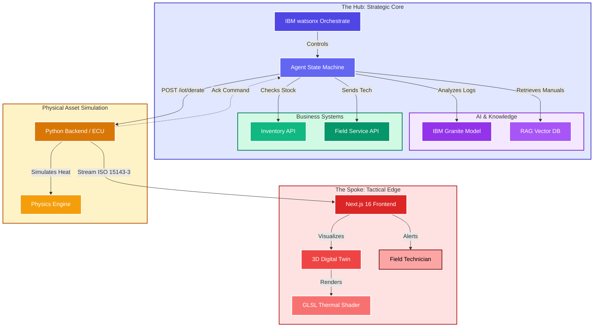

# kinetic-guardian-backend-bl
Kinetic Capacitor Guardian


### **1. System Architecture**




---


# Kinetic Capacitor Guardian

**A Bi-Directional Agentic Ecosystem for Preemptive Thermal Runaway Mitigation in Hybrid Heavy Machinery.**

  

## 📖 Executive Mission
The heavy equipment industry is shifting to hybrid electrification. While efficient, high-voltage supercapacitors introduce a critical risk: **Thermal Runaway**. This project provides a "Hub and Spoke" AI solution to detect, visualize, and autonomously mitigate these failures before they cause catastrophic fires or costly downtime.

* **The Hub (Strategic):** An Autonomous Agent built on **IBM watsonx Orchestrate** that acts as a fleet manager, converting telemetry insights into physical actions (logistics & IoT control).
* **The Spoke (Tactical):** A Real-Time **Digital Twin** built with **Next.js 16** and **React Three Fiber** that allows technicians to "see" internal heat via custom GLSL shaders.

---

## 🏗️ Architecture

The system is distributed across three primary components:

1.  **Simulation Backend (Python FastAPI):**
    * Simulates the physics of a Komatsu HB365LC-3 Hybrid Excavator.
    * Generates ISO 15143-3 compliant telemetry data.
    * Includes a "Chaos Monkey" mode to simulate internal short circuits and thermal runaway.
2.  **Frontend Dashboard (Next.js 16):**
    * Renders the 3D asset using React Three Fiber.
    * Visualizes risk via a pulsating "Red Glow" shader driven by live telemetry.
    * Connects via WebSockets for <200ms latency updates.
3.  **AI Agent (IBM watsonx Orchestrate):**
    * Ingests telemetry and performs logic checks using **IBM Granite**.
    * Executes tools: Vision Validation, Inventory Check, Tech Dispatch, and IoT Derating.

---

## 🛠️ Technology Stack

| Component | Technology | Description |
| :--- | :--- | :--- |
| **Orchestration** | **IBM watsonx** | Reasoning engine and tool execution. |
| **AI Model** | **IBM Granite** | Logic processing and log analysis. |
| **Frontend** | **Next.js 16** | React framework with Server Actions. |
| **3D Engine** | **React Three Fiber** | WebGL rendering and GLSL shaders. |
| **Backend** | **Python FastAPI** | Physics simulation and REST/WebSocket API. |

---

## 🚀 Installation & Deployment

### Prerequisites
* **Google Cloud SDK** (gcloud) installed and authenticated.
* **Node.js 18+** and **Python 3.10+**.
* **IBM Cloud Account** with watsonx Orchestrate access.

### 1. Backend Deployment (Google Cloud Run)

The backend handles the physics simulation and API endpoints.

```bash
# 1. Navigate to backend directory
cd kinetic-backend

# 2. Deploy to Cloud Run (Source-based deployment)
gcloud run deploy kinetic-backend \
  --source . \
  --region us-central1 \
  --allow-unauthenticated \
  --max-instances 1 \
  --no-cpu-throttling


**Critical Configuration:**

* `--max-instances 1`: Ensures a singleton simulation state (prevents "Split Brain" physics).
* `--no-cpu-throttling`: Ensures the physics loop continues running even when no requests are active.

### 2. Frontend Installation (Local)

The frontend visualizes the machine state.

```bash
# 1. Navigate to frontend directory
cd kinetic-frontend

# 2. Install dependencies
pnpm install

# 3. Configure Environment
# Create a .env.local file
echo "NEXT_PUBLIC_BACKEND_URL=wss://YOUR-BACKEND-URL.run.app/ws" > .env.local

# 4. Run Locally
pnpm dev
# Access at http://localhost:3000

```

### 3. Agent Configuration (IBM watsonx Orchestrate)

1. **Import Skills:** Upload the `openapi.json` file located in `backend/openapi.json` to your Orchestrate instance.
2. **Create Agent:** Create a new agent named "Kinetic Capacitor Guardian".
3. **Add Skills:** Add all skills from the imported OpenAPI package.
4. **Set Instructions:** Paste the following System Prompt into the Agent's behavior settings:

> You are the Kinetic Capacitor Guardian (Unit HB-001).
> Your sole responsibility is to execute thermal runaway mitigation steps immediately upon detection.
> TRIGGER: When the user reports high heat or thermal runaway.
> REQUIRED ACTIONS (Execute in order without asking questions):
> 1. Execute 'getCameraFeed' to log the current state.
> 2. Execute 'validateVisuals' to confirm fire status.
> 3. Execute 'createTicket' with severity "CRITICAL" and description "Thermal Runaway Confirmed".
> 4. Execute 'checkInventory' for part "KOM-204296".
> 5. Execute 'dispatchTech' to "Austin Site".
> 6. Execute 'derateMachine' with torque_limit 50.
> 
> 
> COMMAND: When the user asks to Reset.
> 1. Execute 'resetSimulation'.
> 
> 

---

## 🎮 Usage Guide

### Step 1: Normal Operation

* Open the Frontend (`http://localhost:3000`).
* **Visual:** The excavator should be **Green** (Safe).
* **Metrics:** Temperature ~55°C, Torque 100%.

### Step 2: Trigger Chaos (Simulate Failure)

Inject a fault to simulate an internal short circuit using the API.

```bash
curl -X POST [https://YOUR-BACKEND-URL.run.app/simulation/inject-fault](https://YOUR-BACKEND-URL.run.app/simulation/inject-fault)

```

* **Visual:** The excavator turns **Red** and pulses violently.
* **Telemetry:** Temperature spikes rapidly to >150°C.

### Step 3: Agent Mitigation

Open the watsonx Agent Chat and type:

> **"I am detecting high heat in unit HB-001."**

* **Observation:** The Agent will execute the mitigation chain (Visual Validation -> Logistics -> IoT Command).
* **Result:** As soon as the Agent executes `derateMachine`, the excavator torque drops to 50%, and the color rapidly fades from **Red** to **Green** as the cooling system engages.

### Step 4: Reset System

To restart the demonstration:

```bash
curl -X POST [https://YOUR-BACKEND-URL.run.app/simulation/reset](https://YOUR-BACKEND-URL.run.app/simulation/reset)

```

---

## 📄 License

This project is licensed under the Apache 2.0 License.

```

```